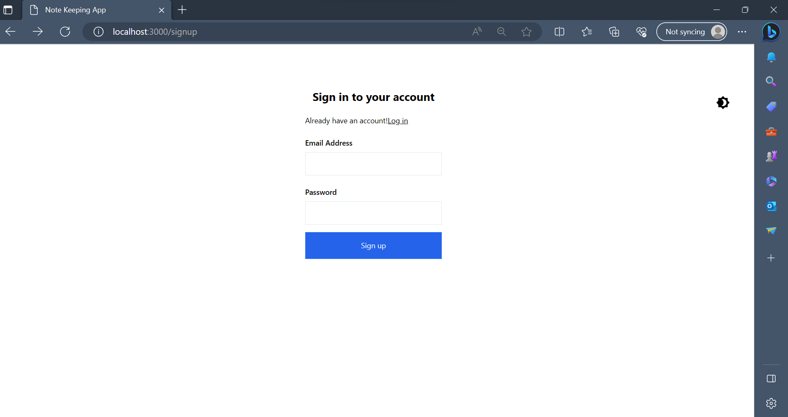
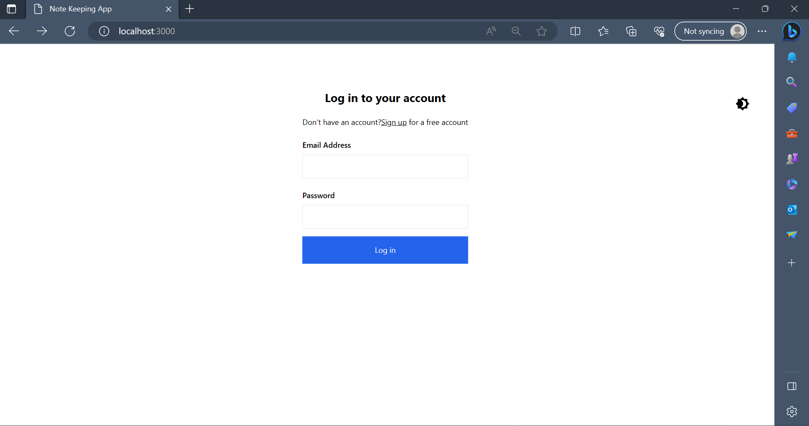
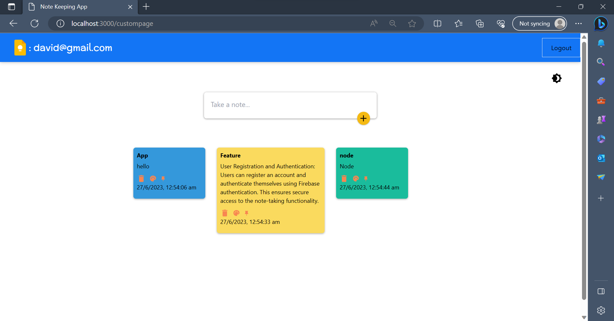
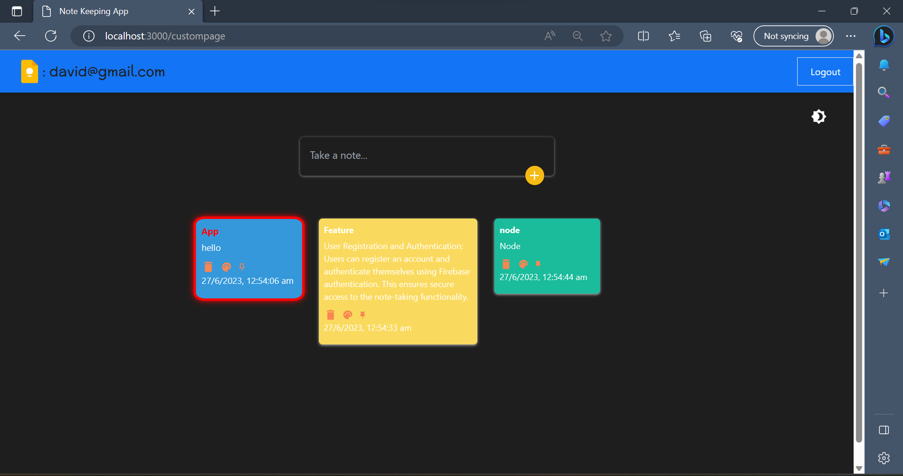

# Note Keeper App (deployed link - hirok-note-keeping.netlify.app)

A sleek and feature-rich note-taking application built with React, Firebase, and dark mode support.

## Features

- Create and manage notes with a title and content.
- Customize note colors.
- Pin notes to keep them at the top of the list.
- Delete notes.
- Firebase authentication for user sign-up and login.
- Dark mode support for a visually appealing interface.
- Show timestamps 

## Technologies Used

- React: A JavaScript library for building user interfaces.
- Firebase: A platform for building web and mobile applications.
- React Router: A routing library for React applications.
- React Icons: A library for utilizing popular icons in React components.
- Styled Components: A library for styling React components with CSS.

## Screenshots


_Registration Page._



_Login Page._



_Dashboard in Light mode._



_Dashboard in Dark mode and one pinned note._


## Setup

1. Clone the repository:

   ```shell
   git clone https://github.com/your-username/note-keeper-app.git

 
   cd note-keeper-app

   
   npm install


   REACT_APP_FIREBASE_API_KEY=your_api_key
   REACT_APP_FIREBASE_AUTH_DOMAIN=your_auth_domain
   REACT_APP_FIREBASE_PROJECT_ID=your_project_id
   REACT_APP_FIREBASE_STORAGE_BUCKET=your_storage_bucket
   REACT_APP_FIREBASE_MESSAGING_SENDER_ID=your_messaging_sender_id
   REACT_APP_FIREBASE_APP_ID=your_app_id

 
   npm start

The app will be accessible at http://localhost:3000.

##Usage
- Sign up or log in to start using the Note Keeper app.
- Create new notes by entering a title and content.
- Customize the color of a note using the color palette.
- Pin a note to keep it at the top of the list.
- Delete a note by clicking the delete button.
- Toggle dark mode for a visually pleasing interface.

